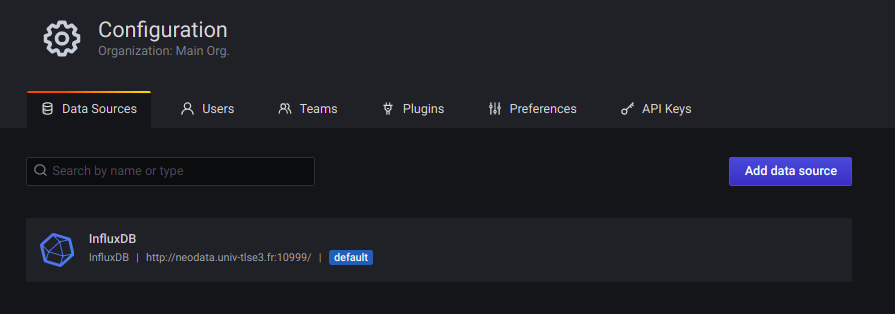
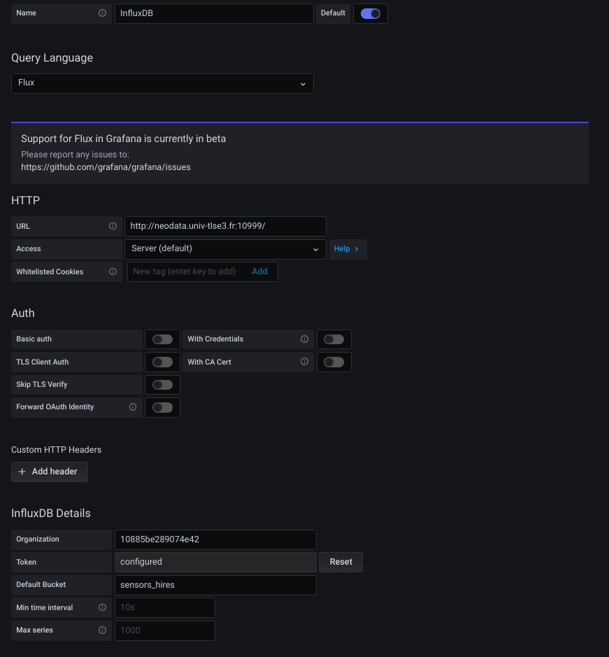
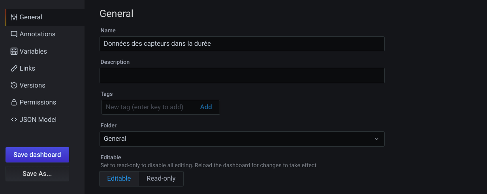
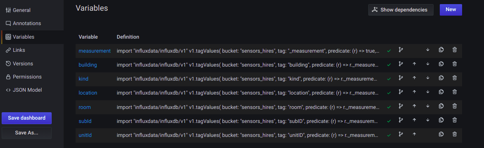
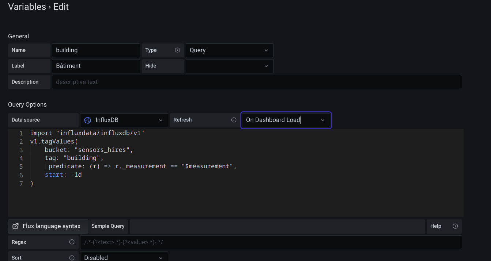
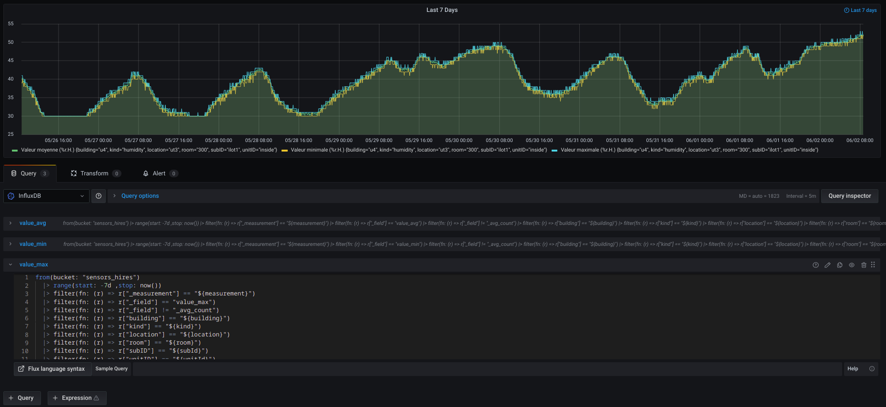
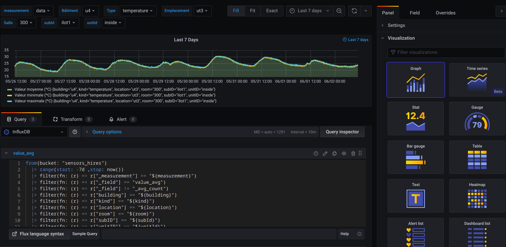
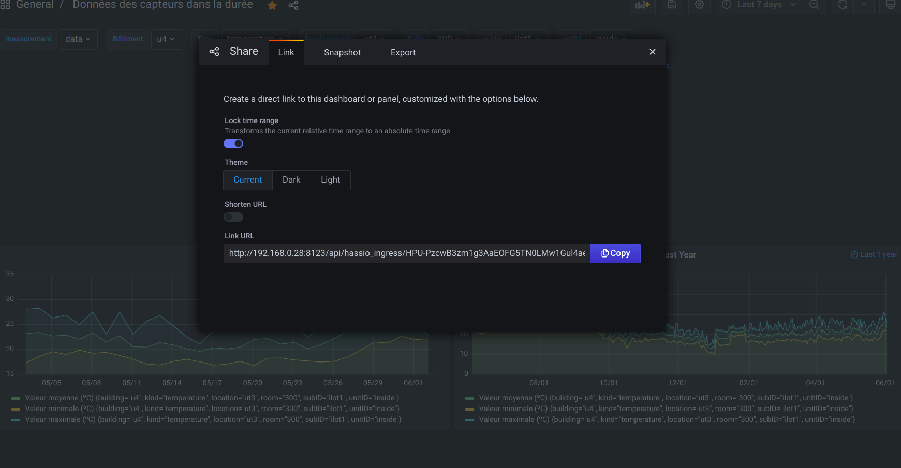
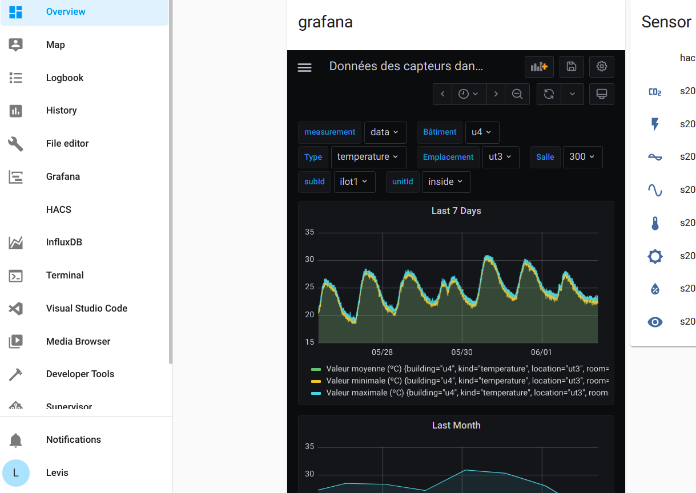

# HomeAssitant
## Installation 

Nous verrons ici tout le processus d’installation et de configuration du projet.


#### Docker Engine

Veillez à installer Docker Engine selon votre OS.

https://docs.docker.com/engine/install/

#### Home Assistant Supervised

Pour la suite du projet nous aurons besoin du Supervisor puisqu’il permet d’avoir un large catalogue de plug-in et applications installables directement depuis l’interface Home Assistant dont Appdaemon dont nous aurons besoin pour le développement.

##### Tutoriel pour installer le supervisor sur une machine Linux
Tout d'abord, vous commencerez par mettre à jour le système d'exploitation pour vous assurer que toutes les dernières mises à jour et correctifs de sécurité sont installés. Pour ce faire, connectez-vous au terminal de votre machine, entrez la commande suivante et appuyez sur Entrée.

```bash
sudo apt update && sudo apt upgrade -y && sudo apt autoremove -y
```

Maintenant que le système d'exploitation est à jour, vous pouvez installer Home Assistant Supervised. Entrez chaque ligne des commandes ci-dessous dans le terminal et exécutez-les une par une.

```bash
sudo -i
apt-get install -y software-properties-common apparmor-utils apt-transport-https ca-certificates curl dbus jq network-manager
systemctl disable ModemManager 
systemctl stop ModemManager
curl -fsSL get.docker.com | sh
curl -sL "https://raw.githubusercontent.com/Kanga-Who/home-assistant/master/supervised-installer.sh" | bash -s
```

#### AppDaemon 
Grâce au supervisor vous pouvez désormais installer l'environnement AppDaemon, indispensable pour exécuter le projet. Pour cela il vous suffit, dans l'application Home Assistant, de cliquer sur l'icône du Supervisor dans la barre latérale gauche. Puis allez dans **Boutique des modules complémentaires** et enfin cherchez AppDaemon.

#### Visual Studio Code
De même, avec la **Boutique des modules complémentaires** vous pouvez télécharger Visual Studio Code pour pouvoir éditer vos fichiers.

#### Mosquitto broker
Pour se connecter aux capteurs vous aurez besoin de vous connecter à un broker qui fera la liaison entre les capteurs et vous. Nous avons décidé de travailler via Mosquitto broker que vous pouvez télécharger et installer via le Supervisor.

Pour cette version du projet, nous avons toujours besoin d'un broker intermédiaire. Le problème est en train d'être réglé mais pour l'instant vous devez installer un broker de votre côté pour le connecter avec celui de l'Université.
Pour cela vous pouvez suivre ce lien :
https://www.vultr.com/docs/how-to-install-mosquitto-mqtt-broker-server-on-ubuntu-16-04

#### Grafana
# Configuration de l'Add-On Grafana dans Home Assistant

Il faut dans un premier temps ajouter l'Add-On Grafana à partir de Home Assistant via le Supervisor.

---

## Configuration de la Data Source

Afin de configurer la source, il faut se rendre dans :
`Menu > Configuration > Data Sources > Add data source`.
Il faut ensuite rentrer tout les paramètres afin d'accéder à la base de données InfluxDB en faisant bien attention à selectionner `Flux` dans le champs `Query Language` (voir images ci-dessous).





---

## Configuration du Dashboard Grafana

Dans `Menu > Dashboard`, Grafana nous donne la possibilité de créer et de modifier des dashboards via `Menu > Create > Dashboard` ou directement dans l'onglet `Menu > Dashboard`.

Sur le dashboard nous avons une multitudes d'options qui s'offre à nous. On peut ajouter des panels afin d'avoir des rendu graphiques et configurer la périodes sur lesquelles on veut afficher les données (via les boutons en haut à droite).

Dans l'onglets `Dashboard > settings`, il est aussi possible d'ajouter des tags, des annotations sur les graphiques, de configurer des variables afin que les graphiques se mettent à jour automatiquement en fonctions des différents topics que l'on souhaite afficher.
On peut aussi definir des permissions et exporter les dashboards en modèle JSON.



---

### Configuration des variables

Afin de pouvoir selectionner les topics que l'on souhaite afficher directement sur le dashboard, il faut configurer les variables.(voir ci-dessous)





---

### Configurations des panels et des requêtes

Pour ajouter un panel, aller dans le dashboard puis cliquer sur `Add panel` en haut à droite.
C'est ici qu'il faudra rentrer les requêtes souhaitées avec le language Flux afin de les afficher.
[lien vers la documentation requêtes avec Flux](https://docs.influxdata.com/influxdb/v2.0/query-data/flux/)



On peut aussi accéder aux options du panel avec le bouton en haut à droite `Show option` pour customiser à sa guise le panel (légende, visualisation, paramètres des axes, ...)



---

## Ajout du Dashboad Grafana au Dashboard de Home Assistant

Enfin, pour finalement ajouter le dashboard Grafana au Dashboard de Home Assistant il suffit simplement de se positionner sur la page du dashboard Grafana qu'on souhaite ajouter puis de cliquer sur le bouton `Share` afin de récupérer l'URL du dashboard.



Il faut ensuite se rendre dans Le dashboard de Home Assistant puis avec le Add-On Lovelace, ajouter une Card afin d'afficher le dashboard Grafana :
` Edit Dashboard > + ADD CARD > Webpage >` puis rentrer l'URL précédemment récupéré.



